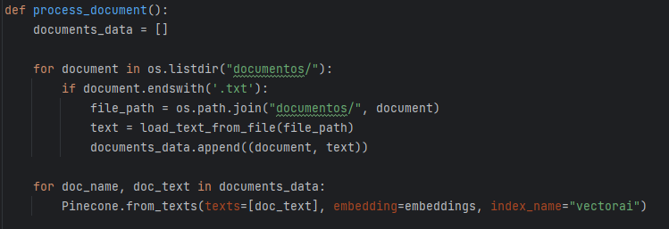
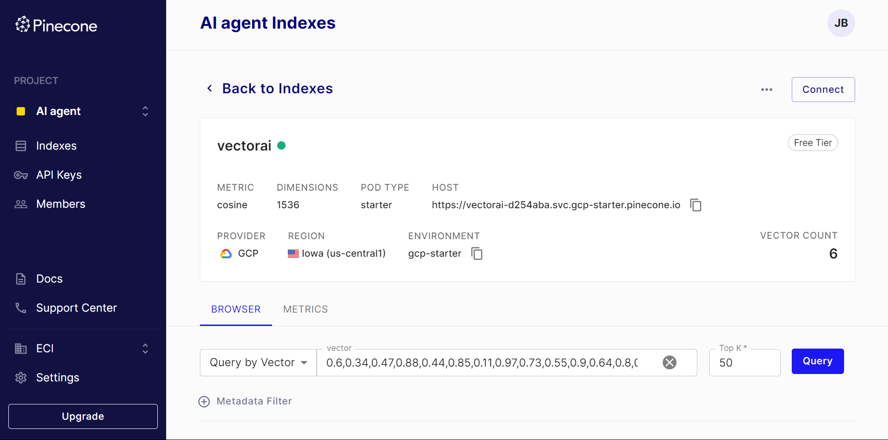
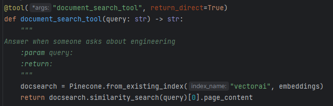

# TAREA DE LLM

Realizar el desafío 1 del taller

## Getting Started

Estas instrucciones te ayudarán a obtener una copia del proyecto en funcionamiento en tu máquina local para desarrollo y pruebas. Consulta la sección de "Despliegue" para obtener notas sobre cómo implementar el proyecto en un sistema en vivo.

### Prerequisites

Cosas que necesitas instalar y cómo hacerlo.

- [Python](https://www.python.org/)

### Installing

Sigue estos pasos para configurar tu entorno de desarrollo:

1. Clona el repositorio:

   ```bash
   https://github.com/juan-bazurto-eci/tarea_arep_llm.git
2. Navega al directorio del proyecto

    ```
   cd tarea_arep_llm
   ```

## Deployment

Corremos el archivo main.py

Crear una base de datos de vectores en Pinecone Starter Version (https://www.pinecone.io/)
usando su correo institucional, cargar los documentos anexos (FAQs de universidades) usando Embeddings de OpenAI y Langchain.


Vector cargador con los documentos anexos en Pinecone



Configurar una Tool de langchain que consulte los documentos y genere una respuesta


## Built With
* [Python](https://www.python.org/) - Lenguaje de programación principal
* [OpenAI](https://openai.com/)
* [Pinecone](https://www.pinecone.io/)
* Git - Control de versiones

## Authors

* **Juan Camilo Bazurto** - [Linkedin](https://www.linkedin.com/in/juan-camilo-b-b65379105/) - [GitHub](https://github.com/juan-bazurto-eci)